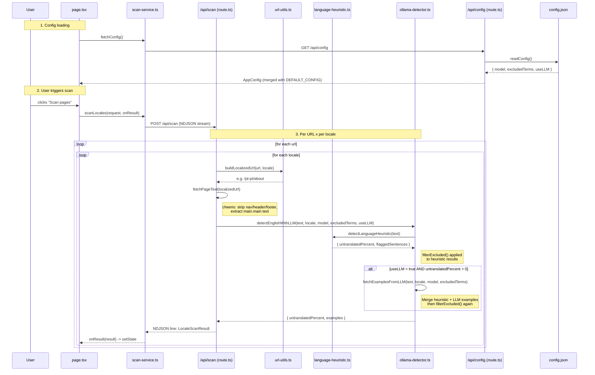

# v1 Scan Architecture Map

Reference architecture of the i18n-scanner v1 scan flow.
Use this as the canonical source when porting or comparing with v2.

## Data Flow



## Files

| File | Purpose |
|------|---------|
| `src/app/page.tsx` | Main page (client component). State management, scan trigger, debounced config saves |
| `src/services/scan-service.ts` | Client fetch wrapper. POST -> NDJSON stream reader |
| `src/services/config-service.ts` | Client fetch wrapper. GET/PUT `/api/config` with partial updates |
| `src/app/api/scan/route.ts` | Server API. Loops URL x locale, streams results as NDJSON |
| `src/app/api/config/route.ts` | Server API. Reads/writes `config.json`. **Merges partials with current config** |
| `src/lib/ollama-detector.ts` | Hybrid detection: heuristic + optional LLM. Excluded terms filtering |
| `src/lib/language-heuristic.ts` | Fast English word-frequency analysis. 160+ marker words |
| `src/lib/url-utils.ts` | `buildLocalizedUrl()` — inserts locale after domain |
| `src/lib/types.ts` | All shared types, `AVAILABLE_LOCALES`, `DEFAULT_EXCLUDED_TERMS` |

## Config Persistence

Storage: **`config.json`** file at project root.

```
readConfig() -> read file -> merge with DEFAULT_CONFIG -> return
writeConfig() -> stringify -> write file
```

### PUT merge pattern (critical)

```typescript
const current = await readConfig()

const updated: AppConfig = {
  model:         typeof body.model === 'string'    ? body.model         : current.model,
  excludedTerms: Array.isArray(body.excludedTerms) ? body.excludedTerms : current.excludedTerms,
  useLLM:        typeof body.useLLM === 'boolean'  ? body.useLLM       : current.useLLM,
}
```

Fields **not sent** fall back to `current.*` (saved value), never to empty defaults.
This is what prevents the debounced partial saves from overwriting each other.

### Default config

```typescript
const DEFAULT_CONFIG: AppConfig = {
  model: '',
  excludedTerms: DEFAULT_EXCLUDED_TERMS,  // ['JavaScript','CSS','HTML','CRM','API','SaaS','AI','Cloud']
  useLLM: false,
}
```

On first run (no `config.json`), `readConfig()` returns `DEFAULT_CONFIG`.
User-added terms (e.g. "Customer Experience", "Talkdesk") are persisted to `config.json`.

## Excluded Terms Flow

### 1. Initial state

```
page.tsx useState -> DEFAULT_EXCLUDED_TERMS (8 terms)
  | useEffect
fetchConfig() -> GET /api/config -> readConfig()
  -> if config.json exists: return saved terms (may include user additions)
  -> if not: return DEFAULT_EXCLUDED_TERMS
```

### 2. User adds/removes terms

```
ExclusionList onChange -> setExcludedTerms(newTerms)
  | useDebouncedSave (500ms)
saveConfig({ excludedTerms: newTerms })
  |
PUT /api/config -> readConfig() -> merge -> writeConfig()
```

### 3. Scan uses terms

```
handleScan() -> scanLocales({ ..., excludedTerms })
  |
POST /api/scan -> scanLocale(url, locale, model, excludedTerms, useLLM)
  |
detectEnglishWithLLM(text, locale, model, excludedTerms, useLLM)
```

### 4. filterExcluded() — multi-word term handling

```typescript
// Split terms into single-word and multi-word
const singleWordExcluded = new Set<string>()    // e.g. "Cloud" -> {"cloud"}
const multiWordExcluded: string[][] = []         // e.g. "Customer Experience" -> [["customer","experience"]]

for (const term of excludedTerms) {
  const words = term.toLowerCase().split(/\s+/).filter(Boolean)
  if (words.length === 1) singleWordExcluded.add(words[0])
  else if (words.length > 1) multiWordExcluded.push(words)
}

// For each flagged sentence:
// 1. Check if ALL words of a multi-word term appear in the sentence's englishWords
// 2. If yes, remove ALL those words from the flagged list
// 3. Also remove single-word excluded terms
// 4. Drop sentences with no remaining english words
```

**Example**: Sentence has `englishWords: ["customer", "experience"]`
- Multi-word term `"Customer Experience"` -> words `["customer", "experience"]`
- Both present in sentence -> mark both for removal
- After filtering: `englishWords: []` -> sentence dropped entirely

### 5. Percent recalculation

After filtering, the untranslated percentage is recalculated:

```typescript
function recalculatePercent(filteredExamples: FlaggedSentence[]): number {
  if (heuristic.totalSentences === 0) return 0
  return Math.round((filteredExamples.length / heuristic.totalSentences) * 100)
}
```

## HTML Extraction (fetchPageText)

1. Fetch page HTML
2. `cheerio.load(html)`
3. Remove: `script, style, noscript, svg, meta, link, head`
4. Remove: `header, nav, footer` (navigation chrome)
5. Prefer: `main.main` > `body` (content root)
6. Append `\n` after block-level elements (headings become separate sentences)
7. Collapse whitespace, keep newlines, trim

## Heuristic Detection

- 160+ English marker words (function words + domain vocabulary)
- Splits text into sentences (by `.!?\n`)
- Tokenizes each sentence (lowercase, min 2 chars)
- Flags sentence if >= 15% of words are English markers
- Returns: `{ untranslatedPercent, totalSentences, englishSentences, flaggedSentences }`

## LLM Detection (optional)

- Splits text into chunks (<= 3000 chars)
- Sends each chunk to Ollama with system prompt
- System prompt instructs: find English sentences, ignore loanwords/brands/excluded terms
- Parses JSON response, validates against source text (anti-hallucination)
- Merges with heuristic results, deduplicates, limits to 5 examples

## NDJSON Streaming

```
Client                          Server
  |                               |
  |  POST /api/scan               |
  |------------------------------>|
  |                               |--- scanLocale(url1, pt-pt)
  |  {"locale":"pt-pt",...}\n     |
  |<------------------------------|
  |                               |--- scanLocale(url1, es-es)
  |  {"locale":"es-es",...}\n     |
  |<------------------------------|
  |                               |
  |  [stream ends]                |
```

Each line is a complete `LocaleScanResult` JSON object.
Special error event: `{ _streamError: "ollama_unavailable", message: "..." }`

## v2 Differences (known bugs)

| Area | v1 (correct) | v2 (bug) |
|------|-------------|----------|
| Config storage | `config.json` file | Payload preferences (DB) |
| PUT merge | Reads current -> merges | Constructs from scratch -> **overwrites other fields** |
| Default terms | `DEFAULT_EXCLUDED_TERMS` on first load | Falls back to `[]` |
| UI framework | MUI 9 | Tailwind + shadcn/ui |
